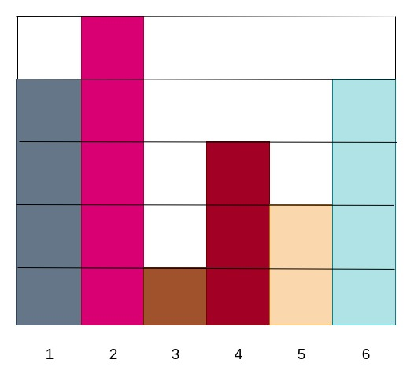

# Questions

## Write code for the following in Javascript

- A list contains first n natural numbers with one missing number. Find the missing number in the list.    
  e.g. for n = 10, numbers = [1,2,3,4,5,6,7,9,10], missing no: 8. [Hint](https://www.geeksforgeeks.org/find-the-missing-number/)
  
- Given a 2D array consisting of only 0s and 1s, where 0 represents sky and all adjacent 1s represent star, find the number of stars. In the given matrix below, there are 2 stars    
  A = [    
    [0, 1, 1, 0, 0],    
    [0, 1, 0, 0, 0],    
    [1, 0, 0, 0, 0],    
    [0, 1, 0, 0, 0],    
    [0, 0, 0, 1, 1]    
  ] [Hint](https://www.geeksforgeeks.org/find-number-of-islands/)
- Find the nth fibonacci number using recursion. Use memoization.
- Given a 2D array, print the elements in the spiral form. Start from bottom left and print from left to right -> bottom to top -> right to left -> top to bottom -> move to 1 level inside -> repeat     
  Array = [    
      [21, 54, 67, 12, 87],    
      [43, 21, 89, 90, 34],    
      [78, 78, 90, 57, 90],    
      [32, 34, 43, 34, 12],    
      [78, 89, 78, 54, 51],    
  ]    
  Output: 78, 89, 78, 54, 51, 12, 90, 34, 87, 12, 67, 54, 21, 43, 78, 32, 34, 43, 34, 57, 90, 89, 21, 78, 90
- Coordinate geometry: Given a point and the line, find the projection of point on line.
- There is an array of numbers. For a given number n
  - find the pairs of number in the array who sum to n. [Hint](https://www.geeksforgeeks.org/count-pairs-with-given-sum/)    
  - find the triplets in the array who sum to n. [Hint](https://www.geeksforgeeks.org/find-a-triplet-that-sum-to-a-given-value/)    
  - e.g. array = [4,5,6,3,4,5,1,2]
    for n = 10,    
    - pairs are (4,6), (5,5)    
    - triplets are (6,3,1),(4,4,2),(5,4,1)     
- Write a code which can take very very large numbers and given their multiplication product
- For a given string, find the anagram of all the strings  
- There is a 2D array. You need to find the all possible combinations that can be formed in the matrix. From any given point, you can traverse in any direction but you can't skip any values. An certain position can't be repeated twice.     
  e.g. for array = [    
    [a,b,f],    
    [c,d,e],    
    [s,v,g],    
  ]    
  - valid combinations: "ab", "abf", "abfd", "bdb", "gda"    
  - invalid combinations: "afe", "abdca", "adca", "afg"
- Given a histogram which contains bars of various heights. Find the total units of water that can be hold in between the bars. In the given image below, total 6 units of water can be hold. 3 units on bar 3, 1 unit on bar 4, 2 units on bar 5. [Hint](https://www.geeksforgeeks.org/trapping-rain-water/)    
